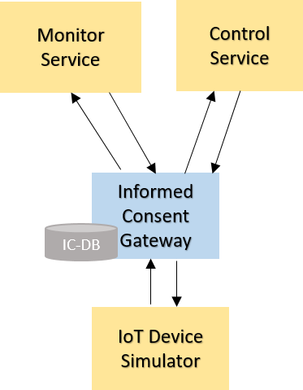

## Single central Informed Consent Gateway

This repo contains a prototypical implementation of a single centralized Informed Consent Gateway. The architecture is shown in the figure below:

All services are implemented in node.js.  
Communication is based on HTTP.  
All communication between services goes through the Informed Consent Gateway.
All consents that are given by the user are stored in the IC-DB database.  
Each consent contains information about datatype, sender, and recipient.
Based on datatype, sender and recipient of a message the Informed Consent Gateway decides if the message gets forwarded to the recipient.  

A running example is available under the following URLs:

IoT Device Simulator: https://iotdevicessimulator-daring-baboon.eu-gb.mybluemix.net/

Informed Consent Gateway: https://informedconsentgateway-chatty-parrot.eu-gb.mybluemix.net/

Monitor Service: https://monitorservice-fearless-koala.eu-gb.mybluemix.net/

Control Service: https://controldevices-cheerful-gnu.eu-gb.mybluemix.net/

Via the IoT Device Simulator and the Control Service different types of data can be send to the gateway.  
The gateway provides an UI that shows the list of consents given by the user and logs containing information about data handling.